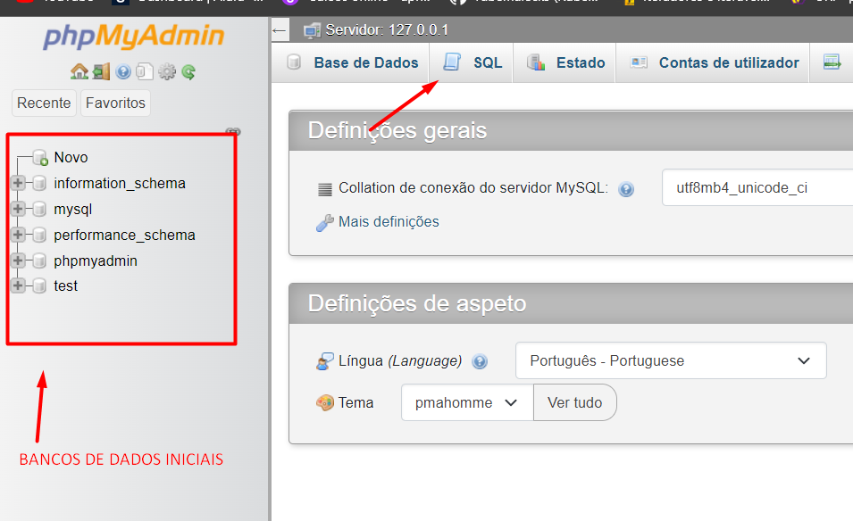
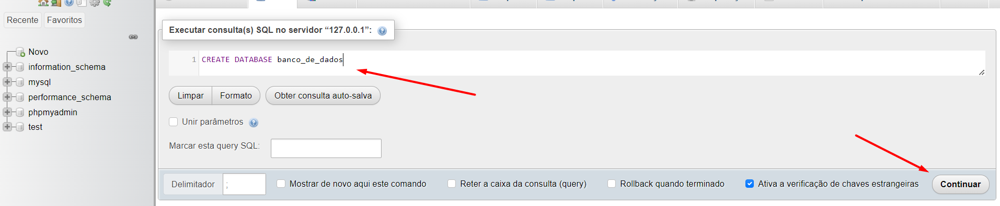
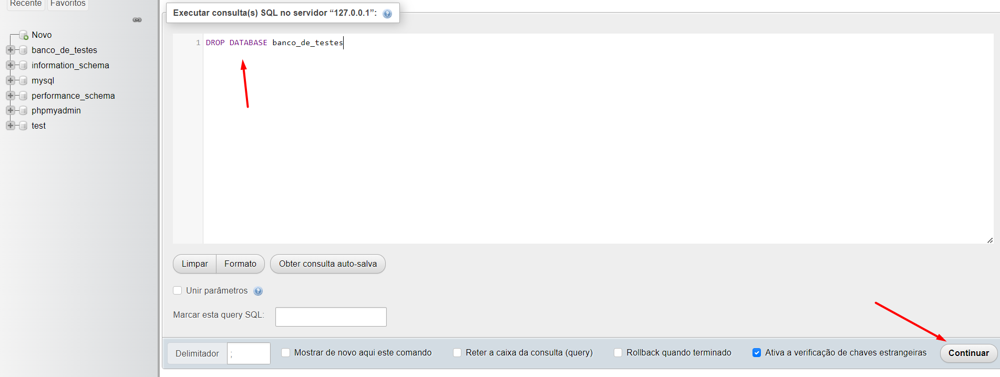

INICIANDO PRIMEIRO BANCO DE DADOS

- ABRIR O XAMPP
    - INICIAR O SERVIDOR APACHE[Start]
    - INICIAR O MySQL [Start]

- CLICAR EM [Admin] (MySQL)
- VAI ABRI A PAGINA DO PHPMYADMIN ["http://localhost/phpmyadmin/"]

Ao clicar em SQL já podemos dar os primeiros comandos para criar um BD, depois editar, excluir e etc ...

TAMBEM PODEMOS EXCLUIR :

