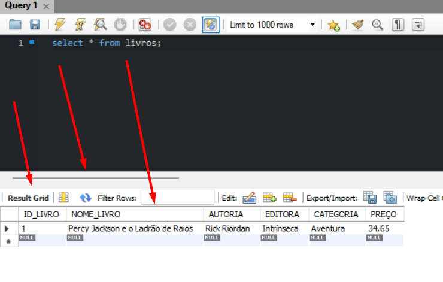

# INSERT INTO

> ANTES DE TUDO, JÁ QUE ADICIONAMOS CHAVES ESTRANGEIRAS, RESTRIÇÕES E ETC ... PODE SER QUE AO TENTAR ADICIONAR OS PRIMEIROS DADOS DÊ ALGUM ERRO, VISTO QUE UMA TABELA DEPENDE DA OUTRA.
> PARA EVITAR ISTO DESATIVE A CHAVE ESTRANGEIRA.

````sql
SET FOREIGN_KEY_CHECKS = 0;
````
> Para voltar elas ao normal, utilize o seguinte comando:

````sql
SET FOREIGN_KEY_CHECKS = 1;
````

------------------------------------
### INSERINDO DADOS:
- NESTE CASO/SINTAXE ELES DEVEM SEGUIR A MESMA ORDEM DEFINIDA NO BANCO DE DADOS

````sql	
INSERT INTO LIVROS VALUES (1, "Percy Jackson e o Ladrão de Raios", 
"Rick Riordan", 
"Intrínseca", 
"Aventura", 
34.65);
````
> Livros Adicionados na tabela livros
> Os elementos podem ser inseridos em uma única linha, porém separando desta forma fica melhor a visualização.

## PARA VER OS DADOS DA TABELA LIVROS USE:

````sql
SELECT * FROM LIVROS;
````



> Caso queira inserir varias linhas/tuplas é só separar por virgula

````sql
INSERT INTO LIVROS VALUES
(2,    
'A Volta ao Mundo em 80 Dias',    
'Júlio Verne',        
'Principis',     
'Aventura',    
21.99),

(3,    
'O Cortiço',                     
'Aluísio de Azevedo',  
'Panda Books',   
'Romance',    
47.8),

(4,    
'Dom Casmurro',                     
'Machado de Assis',    
'Via Leitura',   
'Romance',    
19.90),

(5,    
'Memórias Póstumas de Brás Cubas',    
'Machado de Assis',    
'Antofágica',    
'Romance',    
45),

(6,    
'Quincas Borba',                 
'Machado de Assis',    
'L&PM Editores', 
'Romance',    
48.5),

(7,   
'Ícaro',                             
'Gabriel Pedrosa',     
'Ateliê',          
'Poesia',    
36),

(8,    
'Os Lusíadas',                     
'Luís Vaz de Camões',  
'Montecristo',   
'Poesia',    
18.79),

(9,    
'Outros Jeitos de Usar a Boca',    
'Rupi Kaur',          
'Planeta',          
'Poesia',    
34.8);
````
## EM VENDEDORES

````sql
INSERT INTO VENDEDORES 
VALUES
(1,'Paula Rabelo'),
(2,'Juliana Macedo'),
(3,'Roberto Barros'),
(4,'Barbara Jales');
````

## VENDAS

````sql
INSERT INTO VENDAS 
VALUES 
(1, 3, 7, 1, '2020-11-02'),
(2, 4, 8, 2, '2020-11-02'),
(3, 4, 4, 3, '2020-11-02'),
(4, 1, 7, 1, '2020-11-03'),
(5, 1, 6, 3, '2020-11-03'),
(6, 1, 9, 2, '2020-11-04'),
(7, 4, 1, 3, '2020-11-04'),
(8, 1, 5, 2, '2020-11-05'),
(9, 1, 2, 1, '2020-11-05'),
(10, 3, 8, 2, '2020-11-11'),
(11, 1, 1, 4, '2020-11-11'),
(12, 2, 9, 10, '2020-11-11'),
(13, 1, 7, 5, '2020-11-18'),
(14, 2, 4, 1, '2020-11-25'),
(15, 3, 4, 2,'2021-01-05'),
(16, 4, 2, 1, '2021-01-05'),
(17, 4, 4, 3, '2021-01-06'),
(18, 2, 1, 2, '2021-01-06');
````
## ESTOQUE
````sql
INSERT INTO ESTOQUE 
VALUES
(1,  7),
(2,  10),
(3,  2),
(8,  4),
(4, 5),
(5, 3),
(6, 3);
````