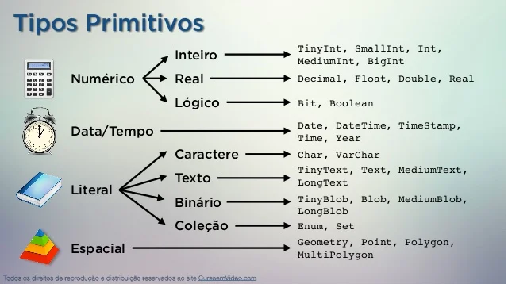

# SQL (_Structure Query Language_)

É uma linguagem abrangente, possui comandos para:

- Definição
- Consulta
- Atualização de dados

Pode ser vista em duas divisões:

- núcleo
- pacote

> - O núcleo dever ser implementados por todos os SGBDs.
> - Os pacotes ...

## Subgrupos da linguagem SQL:

### Principais:

- DDL
- DML
- DQL
  > outros:
- DCL
- DTL

# **DML** - Linguagem de Definição de Dados (_Data Definition Language_)

- Especifica o esquema do Banco de Dados
- Responsável pela criação, alteração e exclusão de tabelas

# **DML** - Linguagem de Manipulação de Dados (_Data Manipulation Language_ )

- Responsável pela manipulação do Banco de dados
  - Inserir novos dados;
  - Alterar dados já persistidos
  - Excluir dados

# **DQL** - Linguagem de Seleção de Dados (_Data Query Language_)

- Responsável pela seleção de registros em uma ou mais tabelas da Base de Dados

# **DCL** - Linguagem de Controle de Dados (_Data Control Language_)

- Responsável por controlar a autorização e direitos de acesso ao Banco de dados;
- Comandos relacionados a segurança do Banco de dados;

# **DTL** - Linguagem de Transação de Dados (_Data Transaction Language_)

- Responsável pelo gerenciamento das diferentes transações de uma banco de dados;

# COMANDOS BÁSICOS SQL

- CREATE (criar)
- ALTER (alterar)
- DROP (apagar a tabela)

# MANIPULAÇÃO DE DADOS (MDL)

> comandos usados pelo usuário comum

- INSERT (inserir)
- UPDATE (atualizar)
- DELETE/REMOVE (deletar o dado)

# SELEÇÃO DE DADOS (DQL/DML)

- **SELECT**
  - DISTINCT (distinção)
  - IS NULL / IS NOT NULL;
  - COUNT, SUM, AVG, MIN, MAX (Funções Embutidas)
  - GROUP BY (_agrupar por ..._)
    - HAVING (_condição p/ agrupar_)
  - BETWEEN (_determinado range de registros_)
  - LIKE (_utilizado para buscar por uma determinada string dentro de um campo com valores textuais_)
  - +, -, \*, / (Comandos aritméticos)
  - ORDER BY (ASC, DESC) _ordenar os dados(ascendente ou descendente_)

# CONTROLE DE DADOS (DTL)

- GRANT (_atribuir permissão_)
- REVOKE (_revogar permissão_)

# TRANSAÇÃO DE DADOS (TDL)

- COMMIT (_consolidar transação / executa os comandos em definitivo_)
- ROLLBACK (_desfazer_)
- SAVEPOINT (_ponto de salvamento na transação_)

# TIPOS DE DADOS

- NÚMERICOS:

  - Inteiro
  - Real
  - Lógico

- DATE

  - Contém 10 posições e seus componentes são ANO, MÊS, E DIA. (yyyy-mm-dd)

- TIME: Contém 8 posições com os componentes HORA, MINUTO E SEGUNDO. (hh:mm:ss)

- BLOB (binary large object): Armazena imagens, vídeos e áudio.
- CLOB (character large object): Armazena textos, no formato de livros disponíveis no ORACLE e DB2 (SQL-99)

# TIPOS PRIMITIVOS SQL

