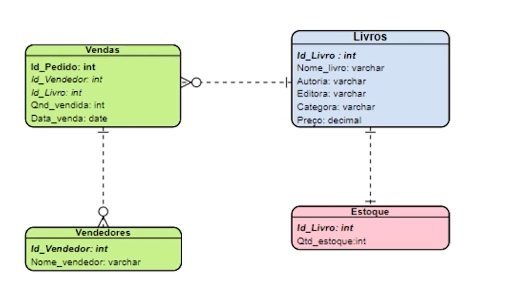
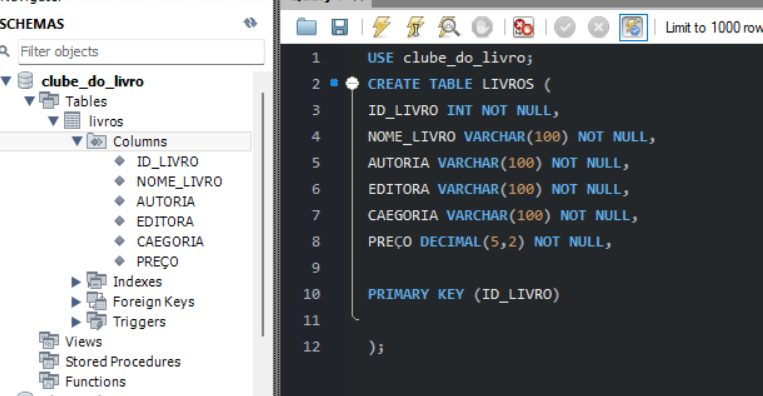

# CRIANDO UM ESQUEMA


# CRIANDO TABELAS


### USAREMOS ESTE ESQUEMA COMO BASE


- 1º - Selecionar o esquema clicando;
## ou

- 1º - Selecionar o esquema via linha de comando (_USE SCHEMA_);
    - OU _USE DATABASE_;


## CRIANDO TABELA

```sql
USE clube_do_livro;
CREATE TABLE LIVROS (
ID_LIVRO INT NOT NULL,
NOME_LIVRO VARCHAR(100) NOT NULL,
AUTORIA VARCHAR(100) NOT NULL,
EDITORA VARCHAR(100) NOT NULL,
CATEGORIA VARCHAR(100) NOT NULL,
PREÇO DECIMAL(5,2) NOT NULL,

PRIMARY KEY (ID_LIVRO)
);
```



- NOTE AO FINAL FOI DEFINIDO  A CHAVE PRIMARIA.


outras tabelas criadas ...
````sql
CREATE TABLE ESTOQUE (
    ID_LIVRO INT NOT NULL,
    QTD_ESTOQUE INT NOT NULL,
 PRIMARY KEY (ID_LIVRO)
);

````

````sql
CREATE TABLE VENDAS (
    ID_PEDIDO INT NOT NULL,
    ID_VENDEDOR INT NOT NULL,
    ID_LIVRO INT NOT NULL,
    QTD_VENDIDA INT NOT NULL,
    DATA_VENDA DATE NOT NULL,
 PRIMARY KEY (ID_VENDEDOR,ID_PEDIDO)
);
````
````sql
CREATE TABLE VENDEDORES (
    ID_VENDEDOR INT NOT NULL,
    NOME_VENDEDOR VARCHAR(255) NOT NULL,
 PRIMARY KEY (ID_VENDEDOR)
);
````