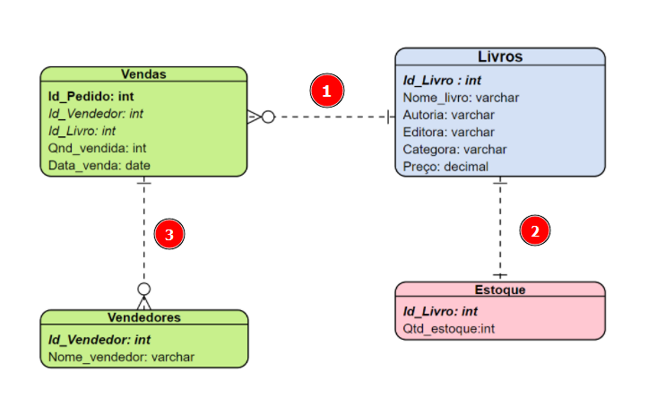

````sql
alter table estoque add constraint CE_ESTOQUE_LIVROS
foreign key(ID_LIVRO)
REFERENCES LIVROS (ID_LIVRO)
on delete no action
on update no action;
````
Sintaxe: alterar table estoque adicionando uma (constraint/restrição) de apelido CE_ESTOQUE_LIVROS onde ID_LIVRO é foreign key usada para referenciar a tabela livros e o campo (ID_LIVRO).


NO ACTION: o banco irá rejeitar o comando, retornando uma exceção de violação de chave estrangeira, ou seja ... se houver um update/ um delete isto ira ocorrer mediante tal situação.

de modo simplificado:
- on delete no action
- on update no action;

Vai gerar um erro toda vez que alterar um livro que estiver na tabela estoque mas não estiver registrado em livros.

## OBSERVE:


HÁ VARIOS RELACIONAMENTOS (ALÉM DE LIVROS x ESTOQUE) QUE PRECISAM SER FEITOS.

````sql
alter table vendas add constraint CE_VENDAS_LIVROS
foreign key(ID_LIVRO)
references LIVROS (ID_LIVRO)
ON DELETE NO ACTION
ON UPDATE NO ACTION;
````
> de mesmo modo, adicionamos o id do livro como chave estrangeira visto que toda venda vai referenciar um livro da tabela livro. 

````sql
alter table VENDAS add constraint CE_vendedor
foreign key(ID_VENDEDOR)
references VENDEDORES (ID_VENDEDOR)
ON DELETE NO ACTION
ON UPDATE NO ACTION;
````
> ... e cada venda possui um vendedor.